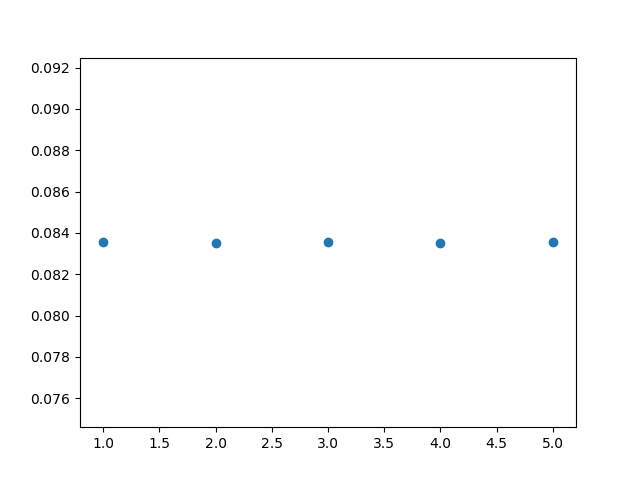
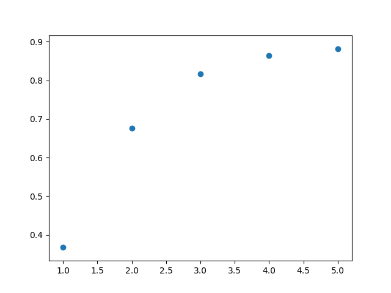

### To train the neural net from the previous hw
```python
python my_img2num.py
```

### I trained it for 5 epochs, the accuracy of each epoch on test set is

#### The total run time is 51.29 sec


### TO train the neural net written in pytorch
```python
python nn_img2num.py
```
### The accuracy of each epoch on test set is

#### The total run time is 31 sec
